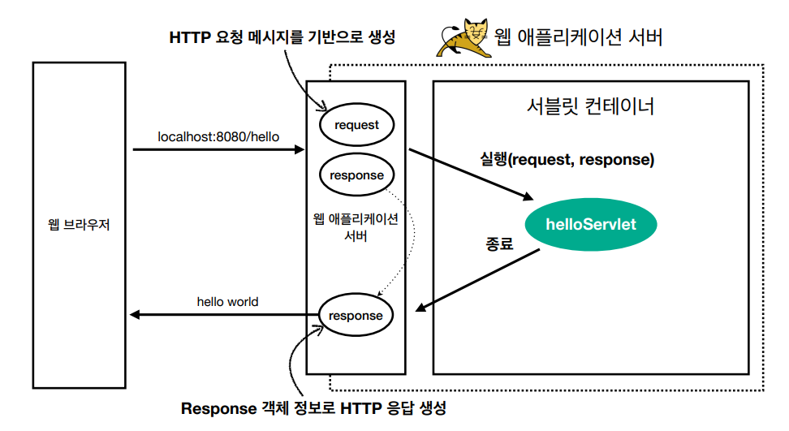
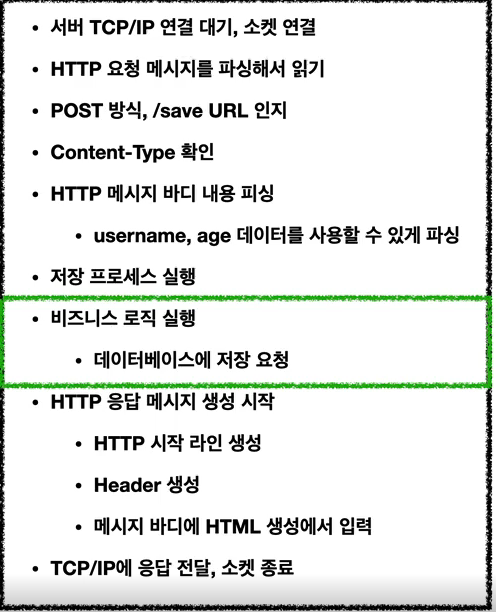
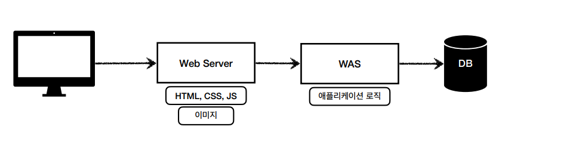

# be-java-cafe

# 학습 계획

- 3단계 까지 진행하면서 예상되는 학습 키워드와, 궁금한 점을 답변해보고 채워본다.
- 김영한님 강의 스프링 기본편, mvc1편을 참고해서 학습한다.
- mvc와 스프링 기본원리에 대해 생각해보며 학습한다.

## 스프링 부트,스프링

### 스프링

- 스프링(Spring)은 자바 기반의 오픈 소스 프레임워크로, 엔터프라이즈급 애플리케이션을 개발하는 데 사용된다.
  스프링의 핵심기능인 DI(Dependency Injection), AOP(Aspect Oriented Programming), MVC(Model-View-Controller) 패턴 등 이 제공되며
  애플리케이션을 보다 유연하게 구성할 수 있도록 해준다. 스프링은 자바 기반의 프레임워크다.

### 스프링 부트

- 스프링 부트(Spring Boot)는 스프링 프레임워크 설정파일(Xml)를 사용하지않고 어노테이션 기반의 설정을 사용한다.
  결국 스프링 부트는 스프링부트는 스프링을 기반으로 개발된 프로젝트를 빠르게 구성할 수 있도록 도와주는 도구이다.

### 스프링에서 HTTP는 기본이다.

전에 cs에서 배운 내용을 토대로 복습한다.

> 참고자료 :https://gist.github.com/leegyeongwhan/f8d9c2fe74ce0e9a663edeeee795cec9

## 스프링 에서 웹 동작 방식을 알아보자.

- 웹어플리케이션 동작과정
  

- 서버에서 처리해야 하는 업무
  
  실제 비지니스 로직에 비해 해야 할 일이 너무 많다 -> 비효율적이다.
  그렇기 때문에 서블릿을 지원하는 WAS들이 비지니스 로직을 제외한 모든 기능을 제공한다.

## 웹 시스템의 구성

### WEB
- Http 기반으로 동작, 정적 리소스 제공
- HTML,CSS,JS
- APACHE
### WAS
HTTP 기반으로 동작
- 웹 서버 기능 포함 + (정적 리소스 제공 가능)
- 프로그램 코드를 실행해서 `애플리케이션 로직` 수행
- 동적 HTML, HTTP API(JSON)
- 서블릿, JSP, 스프링 MVC
- Tomcat
### DB

사실 WAS, DB 만으로 시스템 구성이 가능하다. WAS가 정적 리소스,어플리케이션 로직을 제공하기 때문이다.
하지만 WAS에 너무많은 일을시키면 서버 과부하 우려되고, 어플리케이션 로직은 비용이 비싸다.

그래서 정적 리소스와, 동적리소스를 나눠 처리한다.-> 효율적이다.
### 스프링 부트에서의 GET과 POST 메소드의 동작방식

## MVC

### MVC란 ?

## mustache

### mustache란?

### 템플릿 엔진은?

## backend

### backend란

backend란 정확히 무엇이며, 앞으로 backend개발자가 되면 무엇을 학습해야하고, 생태계를 알아본다.

## web과 spring

결국 스프링은 웹 사이트를 개발할 때 사용할 수 있는 도구이다. 웹 서비스의 구조와,웹 서버 아키텍쳐
,전체 구조에 대해 알아보자.

## DB

전에 cs에서 학습 한 내용을 기반으로 H2 DB에대해 학습한다.

### Spring과 DB

이제 Spring으로 제작한 App과 DB를 연결하고, 동작 방식을 학습한다.
마스터즈 2023 스프링 카페 
